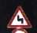
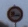
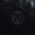

# traffic-sign-classifier

**Traffic Sign Recognition** 

This project implements traffic signs classification with help of convolutional neural network. Project uses prepared [German Traffic Sign Dataset](http://benchmark.ini.rub.de/?section=gtsrb&subsection=dataset) data set for training and raw images for validation to check if model can classify traffic sign images correctly.

Repository contains Python code, Jupyter Notebook file with whole program description and it's html printout, trained neural network and `signnames.csv` file with classes, which network can recognize. 

> **Note:** supplied neural network is trained on TensorFlow version 1.3.0 and it is unlikely to work on TensorFlow with lower version.

`code\image_recognition\signs_recognition.py` file allows custom input image classification. It provides only basic functionaliny. And it will not work correctly with any input.

---

**Build a Traffic Sign Recognition Project**

The goals / steps of this project are the following:
* Load the data set (see below for links to the project data set)
* Explore, summarize and visualize the data set
* Design, train and test a model architecture
* Use the model to make predictions on new images
* Analyze the softmax probabilities of the new images
* Summarize the results with a written report

[//]: # (Image References)

[image1]: ./images/labels.png "Labels amount visualization"
[image2]: ./images/labels_distribution.png "Labels distribution"
[image3]: ./images/model_struct.png "Network structure"
[image4]: ./images/model.png "Graph visualization"
[image5]: ./images/loss.png "Loss"
[image6]: ./images/accuracy.png "Accuracy"
[image7]: ./images/validation_accuracy.png "Validation accuracy"
[image8]: ./test_signs/00080.jpg "Traffic Sign 1"
[image9]: ./test_signs/00233.jpg "Traffic Sign 2"
[image10]: ./test_signs/01190.jpg "Traffic Sign 3"
[image11]: ./test_signs/10359.jpg "Traffic Sign 4"
[image12]: ./test_signs/11944.jpg "Traffic Sign 5"
[image13]: ./test_signs/invalid_data.jpg "Not Traffic Sign"
[image14]: ./images/random_traffic_sign.png "Random traffic sign"

---
**Data Set Summary & Exploration**

<h6>1. The basic summary of the data set.</h6>

I used native python functionality to calculate summary statistics of the traffic
signs data set:

* The size of training set is 34 799
* The size of the validation set is 12 630
* The size of test set is 4410
* The shape of a traffic sign image is 32x32x3
* The number of unique classes/labels in the data set is 43

<h6>2. Exploratory visualization of the dataset.</h6>

It is a bar chart showing how many samples we have for each traffic sign class

![alt text][image1]

Here is a labels distribution among test dataset

![alt text][image2]

Here is a random traffic sigh

![alt text][image14]

---
**Design and Test a Model Architecture**

<h6>1. Training data preprocessing</h6>

Next data preprocessing steps are used in current solution:
 - data is shuffled before each epoch
 - images data type converted to float32:
 
       output = tf.image.convert_image_dtype(input, dtype=tf.float32)

I have also tried suggested normalization `(color_channel - 128) / 128` and different color scheme (HSV instead of RGB) but have not noticed significant accuracy improvement. So I sticked to simplier code.

Number of examples for different sign type in training set varies from 180 to 2010 images. I have assumed normalized training set to have better results, but this assumption was wrong. Accuracy on full set with low dropout grows faster and it more stable with increasing epochs amount.

<h6>2. Neural network structure</h6>

For this work I'm using the LeNet-5 implementation with the next structure:

![alt text][image3]

I'm using dropout technique to reduce overfitting. Dropout is applied to all network layers except of the very last one - linear readout.

So, my final model consisted of the following layers:

| Layer         		|     Description	        					| 
|:---------------------:|:---------------------------------------------:| 
| Input         		| 32x32x3 RGB image   							| 
| Convolution 5x5     	| 1x1 stride, valid padding, outputs 28x28x15 	|
| RELU					|												|
| Max pooling	      	| 2x2 stride,  outputs 14x14x15 				|
| Convolution 5x5	    | 1x1 stride, valid padding, outputs 10x10x75	|
| RELU					|												|
| Max pooling	      	| 2x2 stride,  outputs 5x5x75    				|
| Fully connected		| 600 cells    									|
| Read out      		| 43 classes   									|

At the end I noticed one more problem. Neural network cannot recognize non traffic sign images. I have couple of ideas how to solve it. One solution could be additional class for non traffic sing input. Then training set needs to be extended with some fake data. On the other hand, this problem can be solved with another neural network, or other image analysis technique, not yet known to me. Due to lack of time I have not tried the first option.

Model also includes configured TensorFlow tool for tracking learning process called [**TensorBoard**](https://www.tensorflow.org/get_started/summaries_and_tensorboard). It saves network graph, logs defined data that could be analize during training. It allows to check if everything goes as expected. And the most useful feature to me as a newbie was comparing result from different trainings.

Here is a graph of my neural network: 

![alt text][image4]

<h6>3. Model training</h6>

My model has 3 input parameters: images, corresponding labels and `keep_prob` parameter for dropout. 

Before training is started program creates TensorBoard file with model graph. 

Training process consists of epoch cycles:
 - training set suffle on each epoch start
 - batch training cycle:
     - batch fetching
     - model feed creation
     - labels one hot encoding
     - batch images dtype conversion
     - neural network forward pass
     - cross entropy between softmax network output and one hot ended labeles calculation
     - loss calculation
     - accuracy calculation
     - network state update with help of Adam optimizer in order to minimize distance between one hot encoded labels and softmax network output
     - validation accuracy calculation every ~10k images. It is calculated against whole validation data set.
     - progress output, validation accuracy loggin
     - add process summary into TensorBoard file
 
 At the end of training program saves training checkpoint and some summary into separate file

At this moment model trainer uses next hyperparameters:

    learning_rate = 1e-4
    EPOCHS = 90
    BATCH_SIZE = 200
    # keep_prob parameter for dropout tensor
    drop = 0.3
    # folder to save trained model, TensorBoard training summary and text summary
    tb_log_path = "./tb_logs/E{}_B{}_R{}_D{}_all-data/".format(EPOCHS, BATCH_SIZE, learning_rate, drop)
    # training checkpoint name
    model_path = tb_log_path + "model.ckpt"

Loss/processed images dependency:

![alt text][image5]

Training accuracy/processed images dependency:

![alt text][image6]

Validation accuracy/processed images dependency:

![alt text][image7]

<h6>4. Approach taken for finding a solution</h6>

My final model results were:
* training set accuracy of 99.997%
* validation set accuracy of 95.760% 
* test set accuracy of 94.553%

I'm using well known neural network architecture - [**LeNet**](http://yann.lecun.com/exdb/lenet/). It was suggested as a start point, and it is specially designed to recognize visual patterns directly from pixel images with minimal preprocessing. This model is also very efficient and shows great result on recognizing images. So, I think it is good point to start from.

Model's accuracy on training, validation and test set is more then 94%. It would be nice to find out which images from testing and validation sets misrecognized. It might give a clue for model improvement. I've seen validation set accuracy measurement result higher than 96% during model training. So, I think test accuracy might be improved as well.

---
**Test a Model on New Images**

Here are five German traffic signs that I found on the web:

![alt text][image8]
![alt text][image9]
![alt text][image10]
![alt text][image11]
![alt text][image12]

And one non traffic sign image:

<h6>1. The model's predictions</h6>

Here are the results of the prediction:

| Image			                                |     Prediction	        					| 
|:---------------------------------------------:|:---------------------------------------------:| 
| Double curve                           		| Double curve								    | 
| General caution                       		| General caution 								|
| No passing for vehicles over 3.5 metric tons	| No passing for vehicles over 3.5 metric tons	|
| Priority road                            		| Priority road					 				|
| Speed limit (70km/h)                     		| Speed limit (70km/h) 							|
| Not a traffic sign                        	| Priority road      							|

The model was able to correctly guess 5 of the 5 traffic signs taken from **German Traffic Sign Benchmarks** *([`GTSRB_Final_Test_Images`](http://benchmark.ini.rub.de/?section=gtsrb&subsection=dataset#Downloads))*, which gives an accuracy of 100%.

<h6>2. Final testing traffic sign probabilities</h6>

The code for making predictions on my final model is located in very last cell of the jupyter notebook.

1. The model is absolutely sure that this is a *double curve* (probability of 0.99), and the image does contain a double curve. The top five soft max probabilities were:

    

    | Probability         	|     Prediction	        					| 
    |:---------------------:|:---------------------------------------------:| 
    | 99.998188             | Double curve                                  |
    | 0.001805 	            | Wild animals crossing                         |
    | 0.000007 	            | Dangerous curve to the left                   |
    | 0.000000 	            | Right-of-way at the next intersection         |
    | 0.000000 	            | Road narrows on the right                     |

2. *General caution* (probability of 0.92)

    

    | Probability         	|     Prediction	        					| 
    |:---------------------:|:---------------------------------------------:| 
    | 92.230690	            | General caution                               |
    | 4.975171 	            | Beware of ice/snow                            |
    | 1.223203 	            | Dangerous curve to the right                  |
    | 0.453468 	            | Right-of-way at the next intersection         |
    | 0.382782 	            | Traffic signals                               |

3. *No passing for vehicles over 3.5 metric tons* (probability of 0.99)

    

    | Probability         	|     Prediction	        					| 
    |:---------------------:|:---------------------------------------------:| 
    | 99.999905	            | No passing for vehicles over 3.5 metric tons  |
    | 0.000098 	            | Speed limit (80km/h)                          |
    | 0.000002 	            | Speed limit (100km/h)                         |
    | 0.000001 	            | No passing                                    |
    | 0.000001 	            | Vehicles over 3.5 metric tons prohibited      |

4. *Priority road* (probability of 0.54)

    

    | Probability         	|     Prediction	        					| 
    |:---------------------:|:---------------------------------------------:| 
    | 54.914463	            | Priority road                                 |
    | 36.526901	            | Speed limit (50km/h)                          |
    | 2.243214 	            | Speed limit (30km/h)                          |
    | 2.074297 	            | Roundabout mandatory                          |
    | 1.033213 	            | Yield                                         |

5. *Speed limit (70km/h)* (probability of 0.99)

    

    | Probability         	|     Prediction	        					| 
    |:---------------------:|:---------------------------------------------:| 
    | 99.779874	            | Speed limit (70km/h)                          |
    | 0.161928 	            | Speed limit (120km/h)                         |
    | 0.030254 	            | Speed limit (80km/h)                          |
    | 0.015735 	            | Speed limit (100km/h)                         |
    | 0.008550 	            | Speed limit (30km/h)                          |

6. *Non traffic sing* misrecognized as priority road sign with probability 0.57 

    

    | Probability         	|     Prediction	        					| 
    |:---------------------:|:---------------------------------------------:| 
    | 57.572645	            | Priority road                                 |
    | 29.701543	            | Right-of-way at the next intersection         |
    | 7.705513 	            | End of speed limit (80km/h)                   |
    | 3.749631 	            | Wild animals crossing                         |
    | 0.649604 	            | Speed limit (60km/h)                          |
